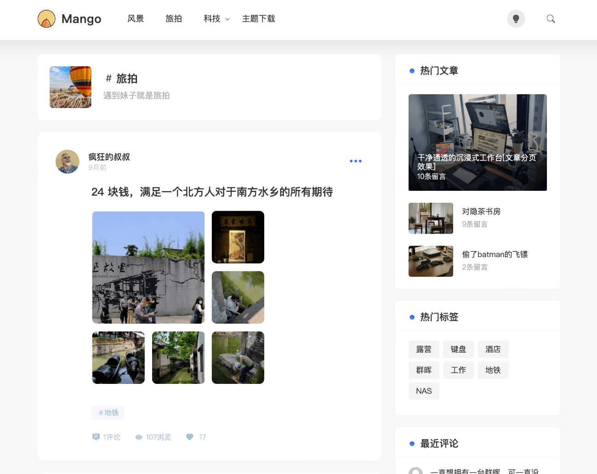

# Mango for Typecho

Mango 是从 WordPress 主题 [Mango](https://github.com/HUiTHEME/Mango) 移植并持续维护的 Typecho 双栏主题，提供响应式文章列表、深浅色模式、文章图片灯箱、文章目录、浏览与点赞统计、评论等级、友情链接和主题配置备份等功能。



## 环境要求

- Typecho 1.2 或更高版本。
- PHP 8.0 或更高版本。
- PHP DOM 扩展，建议启用；未启用时文章目录会使用兼容解析方式。
- 数据库账号需要 `ALTER TABLE` 权限。主题首次统计浏览量和点赞数时，会在 `contents` 表中自动创建 `views`、`likes` 字段。
- `usr/cache/` 目录需要可写，站内图片缩略图缓存保存在 `usr/cache/timthumb/`。
- [Links](https://github.com/typecho-fans/plugins/tree/master/Links) 插件为可选依赖；友情链接页面和首页底部友情链接需要该插件。

## 安装

1. 从 [Releases](https://github.com/jkjoy/Typecho-Theme-Mango/releases/latest) 下载最新版本并解压。
2. 将主题目录放入 Typecho 的 `usr/themes/`，建议将目录命名为 `Mango`。
3. 登录 Typecho 后台，进入 `控制台 > 外观`，启用 Mango。
4. 进入 `设置外观`，按下文完成主题配置。
5. 清理站点、浏览器或 CDN 缓存后访问前台。

### 从旧版本升级

1. 在 `控制台 > 外观 > 设置外观 > 备份与恢复` 中点击“保存主题配置”。
2. 备份已有主题目录和自定义修改。
3. 使用新版本文件覆盖旧版本。
4. 保持升级前后的主题目录名一致。Typecho 按目录名保存主题设置，更改目录名会使原设置无法自动加载。
5. 重新进入主题设置页确认选项，并清理页面缓存、CDN 缓存和浏览器缓存。

不要直接覆盖自行修改过的模板；先比较差异再合并，否则自定义代码会丢失。

## 主题设置

所有选项均位于 `控制台 > 外观 > 设置外观`。

### 全局设置

| 设置项 | 默认值 | 说明 |
| --- | --- | --- |
| 站点 LOGO 地址 | 内置 Mango 图标 | 填写完整图片 URL 或站内图片地址；留空时仅显示站点标题。 |
| 站点 favicon 地址 | 内置 Mango 图标 | 浏览器标签页图标地址。 |
| 默认文章缩略图地址 | 内置占位图 | 文章没有图片或图片加载失败时使用。 |
| Gravatar 镜像 | `https://cravatar.cn/avatar/` | 自定义头像镜像前缀时必须保留末尾 `/`。 |
| 显示模式 | 自动切换 | 可选“自动切换”“始终浅色”“始终深色”。自动模式按本地时间在 06:00 至 18:00 使用浅色，其余时间使用深色。 |
| 文章列表加载模式 | 页码模式 | 可切换为“加载更多”；加载更多使用主题内置 JSON 请求。 |
| 选择字体 | 默认字体 | 可切换为主题内置的霞鹜文楷。 |

### 推荐位设置

“推荐位文章 CID”控制首页幻灯片。填写文章 CID，多个 CID 使用英文逗号或空格分隔，例如：

```text
1,2,3
```

显示顺序与填写顺序一致。留空时不显示推荐位；无效、未发布或不存在的 CID 会被忽略。

### 底部设置

| 设置项 | 默认值 | 说明 |
| --- | --- | --- |
| 备案号码 | 空 | 留空不显示；填写后链接到工信部备案网站。 |
| 首页底部链接 | 不显示 | 启用后调用 Links 插件输出友情链接。必须先安装并启用 Links 插件。 |
| 自定义页脚内容 | 空 | 支持 HTML，可放置统计代码或其他页脚内容。只粘贴可信来源的代码。 |

### 侧边栏设置

“侧边栏模块”可以组合选择以下内容：

- 最新文章
- 最近回复
- 热门文章，按评论数排序
- 热门标签，按文章数量排序
- 文章目录，仅在文章正文页显示
- 其它，包括登录入口和 RSS 链接

数量设置：

| 设置项 | 默认值 | 说明 |
| --- | --- | --- |
| 最新文章数量 | `3` | 控制最新文章模块的条目数。 |
| 热门文章数量 | `5` | 控制热门文章模块的条目数。 |
| 热门标签数量 | `20` | 控制热门标签模块的条目数。 |

文章目录会读取正文中的 `h1` 至 `h6` 标题，自动补充唯一 `id` 并生成锚点。若文章没有标题元素，目录模块不会显示内容。

### 评论设置

“好友邮箱”用于评论区好友认证，一行填写一个邮箱，也支持使用逗号或空格分隔。邮箱匹配不区分大小写。

评论区会根据同一邮箱的历史评论数显示等级。若启用了 Links 插件且友情链接记录中的 `user` 字段与评论邮箱一致，还会显示博友身份。

## 内容发布

### 自定义文章摘要

主题在文章编辑页增加“文章摘要”字段。填写后，首页文章列表优先显示该内容；留空则自动截取正文前 180 个字符。

### 文章图片与缩略图

主题会从以下内容中提取图片：

- HTML `` 标签
- Markdown 图片语法
- 正文中的 JPG、JPEG、PNG、GIF、WebP 图片直链

列表最多展示前 9 张图片。超过 9 张时，第 9 张图片会显示剩余数量。站内图片使用主题内置 TimThumb 生成 400 x 400 缩略图；站外图片直接使用原地址，不经过服务器代理。

图片异常时依次检查：

1. `usr/cache/` 和 `usr/cache/timthumb/` 是否可写。
2. 图片 URL 是否能从浏览器直接访问。
3. 站点是否部署在子目录，以及 Typecho 的站点地址是否正确。
4. “默认文章缩略图地址”是否有效。

### 浏览量与点赞

主题会在 Typecho 的 `contents` 表中自动创建：

- `views`：文章浏览量
- `likes`：文章点赞数

浏览量和点赞均通过 Cookie 限制同一浏览器的重复计数。若一直显示为 `0`，请确认数据库账号具有修改表结构和更新数据的权限。

### 编辑器附件增强

文章和独立页面编辑器会增强附件列表，提供图片预览、全选、取消全选和批量插入。图片以 Markdown 图片语法插入，其他附件以 Markdown 链接语法插入。

## 独立页面

### 文章归档

1. 在后台新建独立页面。
2. 标题可填写“文章归档”。
3. 将页面缩略名设为 `archives`。
4. 发布页面。

主题通过 `page-archives.php` 按年份分组列出所有已发布文章，并显示日期和评论数。

### 友情链接

1. 安装并启用 Links 插件。
2. 在后台新建独立页面。
3. 标题可填写“友情链接”。
4. 将页面缩略名设为 `links`。
5. 发布页面。

主题通过 `page-links.php` 按 Links 插件中的分类字段分组展示链接。头像优先级为：链接图片、邮箱 Gravatar、Links 插件占位图。

如果页面正文中已经包含 `<links ...>` 插件标签，主题会输出正文中的插件结果，不再重复生成链接卡片。

## 导航图标

主题根据页面或分类的缩略名自动选择 Bootstrap Icons。未匹配的分类使用默认文件夹图标。

### 页面缩略名

| 缩略名 | 图标 |
| --- | --- |
| `memos` | 对话 |
| `links` | 友情链接 |
| `about` | 信息 |
| `tags` | 标签 |
| `categories` | 分类 |
| `search` | 搜索 |
| `archives` | 日历 |
| `comments` | 评论 |
| `help` | 帮助 |
| `gbook` | 留言 |
| `tools` | 工具 |

### 分类缩略名

| 缩略名 | 图标 |
| --- | --- |
| `images`、`photo` | 图片 |
| `share` | 分享 |
| `NULL` | 公告 |
| `memos` | 对话 |
| `codes` | 代码 |
| `diary` | 日记 |
| `logs` | 用户 |
| `test` | 日历 |
| `tools` | 工具 |
| `music` | 音乐 |
| `links` | 链接 |
| `video` | 视频 |
| `books` | 图书 |
| `games` | 游戏 |
| `themes` | 调色板 |
| `plugins` | 插件 |

## 备份与恢复

主题设置页支持服务器端配置备份：

- “保存主题配置”将当前主题设置保存到 Typecho 数据库。
- 备份列表最多显示最近 20 条，可恢复或删除。
- 恢复操作会覆盖当前主题设置。
- 备份不包含文章、独立页面、评论、附件、Links 数据或主题文件。

建议在升级主题、修改大量配置和更换站点环境前创建备份。主题目录名改变后，旧设置和备份不会自动关联到新目录名。

## 更新检查

进入主题设置页时，主题会请求 GitHub Releases 检查新版本。检查结果缓存在 `usr/cache/version.json`，默认缓存 12 小时。无法访问 GitHub 时不会影响前台页面，主题会优先使用已有缓存。

## 常见问题

### 启用主题后设置为空

确认主题目录名是否与升级前一致。Typecho 使用主题目录名区分设置。

### 开启首页底部链接后页面报错

先安装并启用 Links 插件，再开启“首页底部链接”。该选项会直接调用插件输出方法。

### 友情链接页面提示未启用插件

确认插件目录名为 `Links`，并已在 Typecho 后台启用。页面缩略名必须为 `links`。

### 缩略图无法显示

确认 PHP 有权创建并写入 `usr/cache/timthumb/`，同时核对 Typecho 站点地址和图片 URL。主题禁止 TimThumb 拉取远程图片，这是预期的安全限制。

### 浏览量或点赞始终为 0

确认数据库账号具有 `ALTER TABLE` 和 `UPDATE` 权限，并检查 PHP 错误日志中是否存在 `views` 或 `likes` 字段创建失败的信息。

## 1.6.0 更新说明

- 恢复 Typecho 标准头部钩子，保证插件可以正常向页面 `<head>` 注入资源。
- 修复部分环境下评论提交的来源校验与安全令牌问题。
- 移除 `gotopage.php` 及站外链接跳转提示页，文章和评论中的链接恢复原始地址。
- 友情链接页面改为当前窗口打开。
- 重构 README，补齐安装、设置、内容发布、备份恢复和排错说明。

## 致谢

- 原 WordPress 主题：[HUiTHEME/Mango](https://github.com/HUiTHEME/Mango)
- Typecho 移植与维护：[jkjoy](https://github.com/jkjoy)
